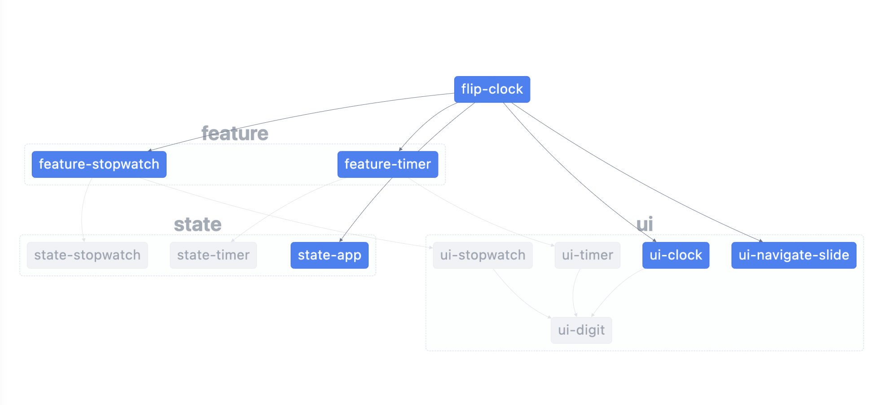

# FlipClock

https://strongermyself.github.io/flip-clock/

---

✨ **This workspace has been generated by [Nx, a Smart, fast and extensible build system.](https://nx.dev)** ✨

## Development server

Run `npm run dev` for a dev server. Navigate to http://localhost:4200/. The app will automatically reload if you change any of the source files.

## Understand this workspace

Run `nx graph` to see a diagram of the dependencies of the projects.

## Further help

Visit the [Nx Documentation](https://nx.dev) to learn more.

## Used commands in development:

- `nx g lib ui/name`
- `nx g lib feature/name`
- `nx g @nrwl/workspace:library state/name` *(need template)*
- `nx g component name -p project`  
